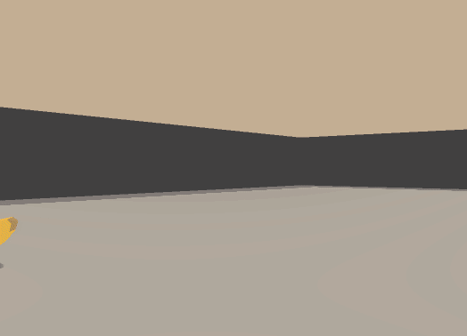
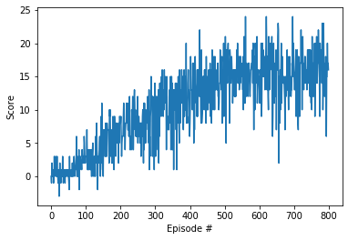

# Navigation


In this project we use the Unity ML-Agents environment to teach an DRL-agent to collect yellow bananas:




## Project Details

This project consist of training an agent to navigate and collect bananas in a large, square world.

A reward of +1 is provided for collecting a yellow banana, and a reward of -1 is provided for collecting a blue banana. Thus, the goal of the agent is to collect as many yellow bananas as possible while avoiding blue bananas.

The state space has 37 dimensions and contains the agent's velocity, along with ray-based perception of objects around the agent's forward direction. Given this information, the agent has to learn how to best select actions. Four discrete actions are available, corresponding to:

- `0` - move forward.
- `1` - move backward.
- `2` - turn left.
- `3` - turn right.

The task is episodic, and in order to **solve** the environment, the agent must get an average score of +13 over 100 consecutive episodes.

In order to run the notebook, the following dependencies need to be met:

### 1. Instructions: 

1. Install python3 and pytorch
2. Open a project with virtual env as mentioned in [DRLND GitHub repository](https://github.com/udacity/deep-reinforcement-learning#dependencies)  in the dependencies section.
3. Installed [Unity ML-Agents](https://github.com/Unity-Technologies/ml-agents/blob/master/docs/Installation.md) and [NumPy](http://www.numpy.org/).
4. In Navigation.ipynb change the `bananFile` parameter to match the location of the Unity environment that you downloaded.
   - **Mac**: `"path/to/Banana.app"`
   - **Windows** (x86): `"path/to/Banana_Windows_x86/Banana.exe"`
   - **Windows** (x86_64): `"path/to/Banana_Windows_x86_64/Banana.exe"`
   - **Linux** (x86): `"path/to/Banana_Linux/Banana.x86"`
   - **Linux** (x86_64): `"path/to/Banana_Linux/Banana.x86_64"`
   - **Linux** (x86, headless): `"path/to/Banana_Linux_NoVis/Banana.x86"`
   - **Linux** (x86_64, headless): `"path/to/Banana_Linux_NoVis/Banana.x86_64"`


### 2. The Environment

The environment info:

    INFO:unityagents:
    'Academy' started successfully!
    Unity Academy name: Academy
            Number of Brains: 1
            Number of External Brains : 1
            Lesson number : 0
            Reset Parameters :
    		
    Unity brain name: BananaBrain
            Number of Visual Observations (per agent): 0
            Vector Observation space type: continuous
            Vector Observation space size (per agent): 37
            Number of stacked Vector Observation: 1
            Vector Action space type: discrete
            Vector Action space size (per agent): 4

Environments contain **_brains_** which are responsible for deciding the actions of their associated agents. Here we check for the first brain available, and set it as the default brain we will be controlling from Python.

The environment supports multi agent (brains), but here we will use only one.  


### 3. Project main files

**Navigation.ipynb** - Running the learning process which includes interaction between the unity environment and our agent. 

**dqn_agent.py** - The implementation of our DQL agent. Consists of Agent class and ReplayBuffer class. The 

**model.py** - the network used by our agent for modeling the Q function.

**checkpoint600_37fc50fc40fc4.pth** -  weights of the trained agent.

**checkpoint600_37fc50fc40fc4_memory_pickelTest1.dat** - The ReplayBuffer of our trained agent.

 

### 3. Define the agent and training:


Runing the main learning loop is evoked by calling dqn in the Navigation.ipynb:

```python
scores = dqn(n_episodes=800, max_t=300, eps_start=1.0, eps_end=0.01, eps_decay=0.995)
```

The call should yield the following:

    Episode 50	Eps 0.78	Average Score: 0.46
    Episode 100	Eps 0.61	Average Score: 1.01
    Episode 150	Eps 0.47	Average Score: 2.29
    Episode 200	Eps 0.37	Average Score: 4.45
    Episode 250	Eps 0.29	Average Score: 6.84
    Episode 300	Eps 0.22	Average Score: 7.86
    Episode 350	Eps 0.17	Average Score: 9.03
    Episode 400	Eps 0.13	Average Score: 10.50
    Episode 450	Eps 0.10	Average Score: 12.00
    Episode 500	Eps 0.08	Average Score: 13.55
    Episode 550	Eps 0.06	Average Score: 14.77
    Episode 600	Eps 0.05	Average Score: 15.46
    Episode 650	Eps 0.04	Average Score: 15.41
    Episode 700	Eps 0.03	Average Score: 15.10
    Episode 750	Eps 0.02	Average Score: 15.02
    Episode 800	Eps 0.02	Average Score: 15.63





# Saving testing and loading the agent 

### Make sure model weights are saved:


```python
torch.save(agent.qnetwork_local.state_dict(), r'checkpoint600_37fc50fc40fc4.pth')
```
I also saved the replay buffer for continuing the learning stage where it was stopped: 

```python
import pickle
memory = agent.memory.memory.copy()
with open('checkpoint600_37fc50fc40fc4_memory_pickelTest1.dat','wb') as outf:
    for mem in memory:
        for field in mem:
            pickle.dump(field, outf)
```

### Test model (visually):


```python
import time
agent.qnetwork_local.eval()
agent.qnetwork_target.eval()
env_info = env.reset(train_mode=False)[brain_name]  # Roee
#state = env.reset()  # Roee : added commented
state = env_info.vector_observations[0]

score = 0
steps = 0
with torch.no_grad():
    while True:
        steps+=1
        action = agent.act(state, 0)
        env_info = env.step(action)[brain_name]
        next_state = env_info.vector_observations[0]   # get the next state
        reward = env_info.rewards[0]                   # get the reward
        done = env_info.local_done[0]                  # see if episode has finished
        state = next_state
        score += reward
        time.sleep(0.05)
        if reward==1:
            print("Yellow!")
        elif reward==-1:
            print("Blue...")
        if done:
            break

            
print('Number of steps = ' + str(steps))
print('Score = ' + str(score))
```


## Loading previously trained agent (memory and network weights):


```python
from dqn_agent import Agent

agent = Agent(state_size=37, action_size=4, seed=0, fc1_units=50, fc2_units=40)

import pickle
buffSize = int(1e5)

with open('checkpoint600_37fc50fc40fc4_memory_pickelTest1.dat','rb') as inpf:
    for i in range(buffSize):
        state, action, reward, next_state, done = (pickle.load(inpf), pickle.load(inpf), pickle.load(inpf), pickle.load(inpf), pickle.load(inpf))
        agent.memory.add(state, action, reward, next_state, done)
        
import torch
state_dict = torch.load('checkpoint600_37fc50fc40fc4.pth')
agent.qnetwork_local.load_state_dict(state_dict)
agent.qnetwork_target.load_state_dict(state_dict)
```


Closing the environment:

```python
env.close()
```
