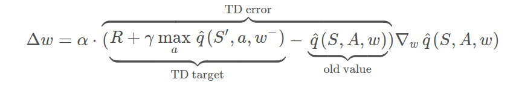
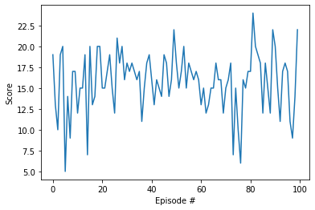

# Navigation


To solve the environment I used the the following basic network interface:

**Input :** state (37 dimension)

**Output :** action-value for each action (4 dimensions)

    QNetwork(
      (fc1): Linear(in_features=37, out_features=50, bias=True)
      (fc2): Linear(in_features=50, out_features=40, bias=True)
      (fc3): Linear(in_features=40, out_features=4, bias=True)
    )

An agent is comprised of 2 basic networks - one **local-network**, one **target-network** and a **replay buffer** which stores 100,000 of the last experience tuple (state, action, reward, next state, done). The local-network is used to select actions in the **act** function for every step in the episode using an $\epsilon$-greedy policy.

learning with fixed targets:

In the **learn** function the local-network along with the batch states-actions are used to obtain a **expected values**, the target-network along with rewards-next_states is used to assess the **target values**. Finally the optimization step changes the weights of the local-network to reduce the mse between the the target values and the expected values. 



Once every **UPDATE_EVERY** the local-network is copied via a soft update (**TAU**) to the target network. This is done to enable a policy assessment period before updating the network.


Chosen hyper parameters:

```
BUFFER_SIZE = int(1e5)  # replay buffer size
BATCH_SIZE = 64         # minibatch size
GAMMA = 0.99            # discount factor
TAU = 2e-3            # for soft update of target parameters  # ROEE mult by 2
LR = 5e-4               # learning rate 
UPDATE_EVERY = 8
```


The main learning loop is evoked by calling:

```python
scores = dqn(n_episodes=800, max_t=300, eps_start=1.0, eps_end=0.01, eps_decay=0.995)
```

The learning output:

```
Episode 50	Eps 0.78	Average Score: 0.46
Episode 100	Eps 0.61	Average Score: 1.01
Episode 150	Eps 0.47	Average Score: 2.29
Episode 200	Eps 0.37	Average Score: 4.45
Episode 250	Eps 0.29	Average Score: 6.84
Episode 300	Eps 0.22	Average Score: 7.86
Episode 350	Eps 0.17	Average Score: 9.03
Episode 400	Eps 0.13	Average Score: 10.50
Episode 450	Eps 0.10	Average Score: 12.00
Episode 500	Eps 0.08	Average Score: 13.55
Episode 550	Eps 0.06	Average Score: 14.77
Episode 600	Eps 0.05	Average Score: 15.46
Episode 650	Eps 0.04	Average Score: 15.41
Episode 700	Eps 0.03	Average Score: 15.10
Episode 750	Eps 0.02	Average Score: 15.02
Episode 800	Eps 0.02	Average Score: 15.63
```

Notice that the environment was solved in under 500 episodes.


### Test 100 consecutive episodes:


```python
agent.qnetwork_local.eval()
agent.qnetwork_target.eval()
with torch.no_grad():
    scores = dqn(n_episodes=100, eps_start=0.01)
fig = plt.figure()
ax = fig.add_subplot(111)
plt.plot(np.arange(len(scores)), scores)
plt.ylabel('Score')
plt.xlabel('Episode #')
plt.show()
```

    Episode 50	Eps 0.01	Average Score: 15.90
    Episode 100	Eps 0.01	Average Score: 15.75





### One more change:

While looking and some random episode I noticed that the agent got stuck between two blue bananas. After thinking about it for a while I came up with the following solution. I added a negative reward to the reward obtained by the environment. 

```python
agent.step(state, action, reward-0.01, next_state, done)
```

This might urge the agent to take the blue banana despite of the immediate negative reward. I assume that this helps more in the beginning (when the optimal policy is not yet clear) because in the end the agent should already know that usually its worth eating the blue banana for many future yellow ones.


### Future improvements:

* Tweak some more with the hyper parameters

* Implement dueling DRL setup

* Implement Prioritized Experience Replay

* Increase state size by adding previous states to input

  This might help when no bananas are in sight but were seen not too long ago (e.g. before moving forward)

* Add the time step $i$ as an input to the network ($i\in1,...,300$)

  This might help when deciding near the end of the game to go towards a large group of yellow bananas that is far away or a close single banana just in time.